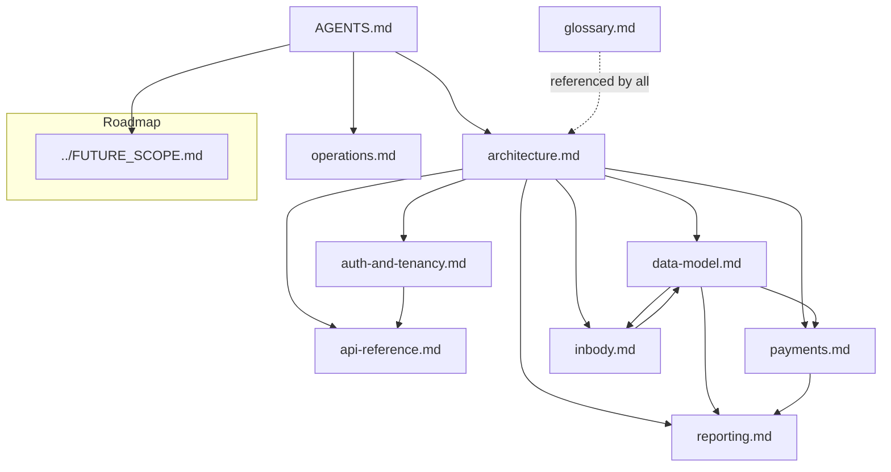

# RevOS Documentation

This folder is the **context graph** for RevOS — a complete, code-grounded set of
docs so any engineer or AI agent can open the repo and operate confidently.
Start with the root [`AGENTS.md`](../AGENTS.md), then dive into any node below.

## Reading order

1. [`architecture.md`](./architecture.md) — the big picture + diagrams (module
   map, request lifecycle, tenancy model).
2. [`data-model.md`](./data-model.md) — Prisma models, ER diagram, money rules.
3. [`auth-and-tenancy.md`](./auth-and-tenancy.md) — roles, sessions,
   impersonation, and the route guards.
4. [`api-reference.md`](./api-reference.md) — every page + API route with method,
   auth guard, and purpose.
5. Subsystem deep dives:
   - [`payments.md`](./payments.md) — LunarPay + Fortis, all payment concepts.
   - [`reporting.md`](./reporting.md) — revenue-share math + clinic-balance formula.
   - [`inbody.md`](./inbody.md) — InBody ingestion + phone auto-pairing.
6. [`operations.md`](./operations.md) — env, commands, cron, deploy, security.
7. [`glossary.md`](./glossary.md) — domain vocabulary.

## Documentation graph

How the docs (and the subsystems they describe) connect:

## Keeping docs in sync

Each doc cites the exact source files it describes. When you change a subsystem,
update the matching doc in the same change. The invariants listed in
[`AGENTS.md` §6](../AGENTS.md) are the highest-value things to keep accurate.
