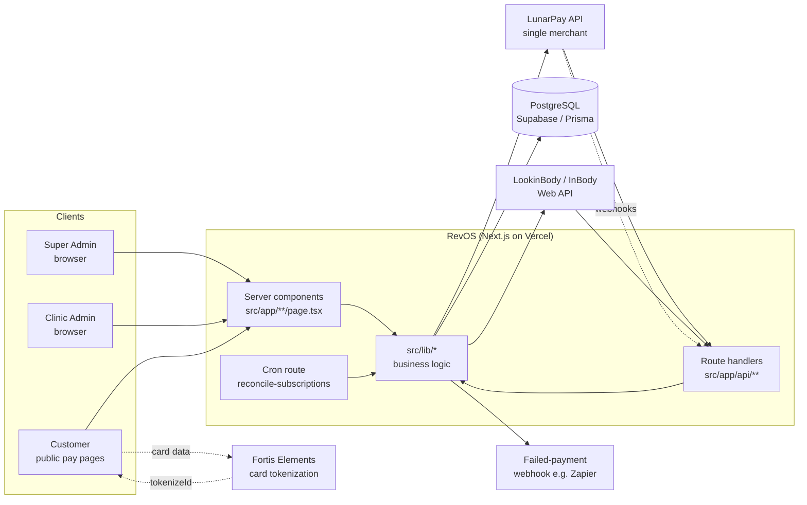
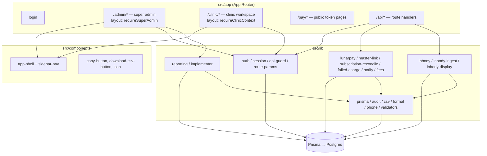
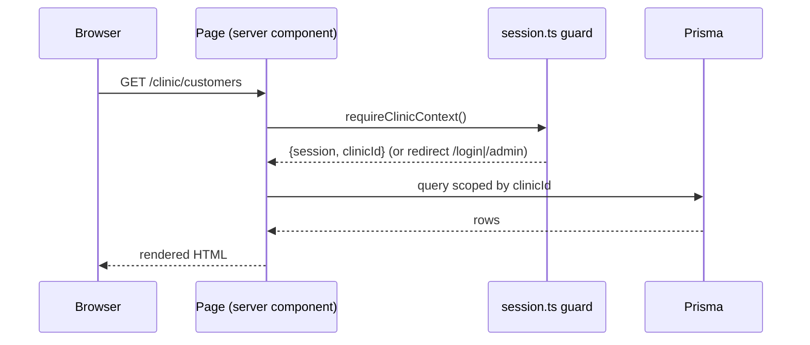
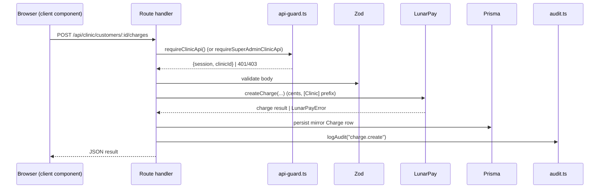
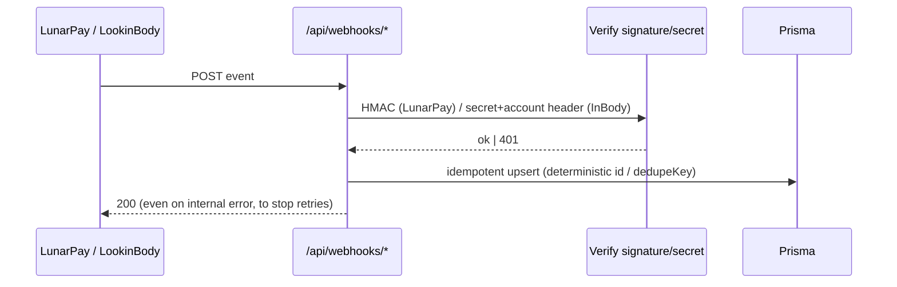
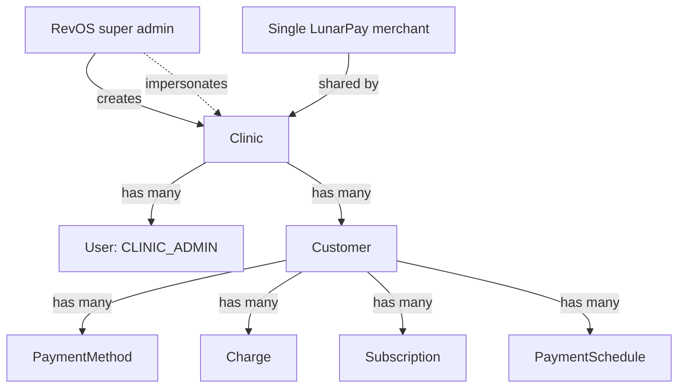

# Architecture

RevOS is a single Next.js 15 (App Router) application. There is no separate
backend service — server logic lives in **route handlers** (`src/app/api/**`)
and **server components** (`src/app/**/page.tsx`), both calling into shared
modules in `src/lib/`. State persists in PostgreSQL via Prisma. All payment
side effects go through one shared LunarPay merchant.

## System context

Key point: **card data flows customer → Fortis directly** (dashed). RevOS only
ever receives a `tokenizeId`, which it exchanges with LunarPay for a reusable
`paymentMethodId`. See [`payments.md`](./payments.md).

## Layered module map

## Request lifecycle

### Authenticated page (server component)

### Mutating API call (route handler)

### Inbound webhook (LunarPay / InBody)

## Multi-tenancy model

RevOS owns the `Customer → Clinic` mapping itself; LunarPay has no clinic
concept. Every tenant-scoped table carries a nullable `clinicId`. Scoping is
enforced in application code (the guards resolve an `effectiveClinicId`), not
yet by Postgres row-level security (see `FUTURE_SCOPE.md` §8).

The `[Clinic Name]` prefix on every LunarPay charge description keeps the shared
merchant dashboard auditable per clinic.

## Where things run

- **Runtime data plane**: pooled Supabase Postgres URL (`DATABASE_URL`, port
  6543). Prisma migrations use the direct URL (`DIRECT_URL`, port 5432).
- **Cron**: `vercel.json` schedules `GET /api/cron/reconcile-subscriptions`
  nightly at `0 8 * * *` (UTC). It requires a `CRON_SECRET` bearer token.
- **Deploy**: Vercel (`vercel.json`, `next build` runs `prisma generate`).

Continue to [`data-model.md`](./data-model.md) for the persistence layer.
