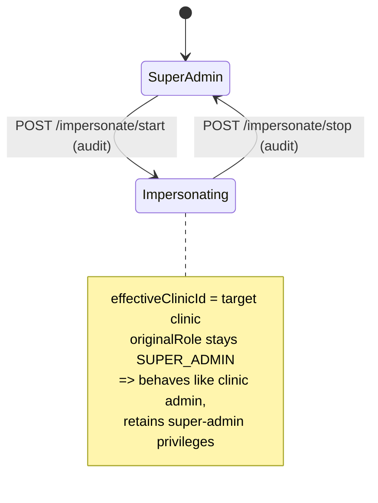

# Auth & Tenancy

RevOS uses NextAuth with a Credentials provider and **JWT sessions** (no DB
session store). Passwords are bcrypt-hashed. Multi-tenancy and the super-admin
"impersonation" feature are both encoded in the JWT/session.

Files: `src/lib/auth.ts`, `src/lib/session.ts`, `src/lib/api-guard.ts`,
`src/app/api/auth/[...nextauth]/route.ts`, `src/app/login/*`.

## Roles

Prisma enum `Role`:

- **`SUPER_ADMIN`** — RevOS staff. Global access. Can create clinics, view all
  data, run reports, and *impersonate* any clinic. Seeded by `prisma/seed.ts`.
- **`CLINIC_ADMIN`** — belongs to one `Clinic` (`user.clinicId`). Scoped to that
  clinic's workspace.

Additional roles (`PROVIDER`, `BILLING_DEPT`) are roadmap only — see
`FUTURE_SCOPE.md` §1.

## Session shape

`auth.ts` augments the NextAuth `Session.user`:

| Field | Meaning |
| --- | --- |
| `id`, `email`, `name` | Identity. |
| `role` | The user's stored role. |
| `clinicId` | The user's *own* clinic (null for super admin). |
| `effectiveClinicId` | The clinic currently in scope — own clinic, or the impersonated clinic for a super admin. **This is what route logic scopes by.** |
| `impersonating` | `true` when a super admin has an active impersonation. |
| `originalRole` | The true role, used for privilege checks (so impersonation never drops privileges). |

### Impersonation encoding

The JWT stores `impersonatingClinicId`. A super admin starts impersonation by
calling `POST /api/admin/impersonate/start`, which (with client-side
`session.update({ impersonatingClinicId })`) sets that field; the `session`
callback then computes `effectiveClinicId = impersonatingClinicId`. Stopping
(`/api/admin/impersonate/stop`) clears it. Both are audit-logged.



## Guards

### Server components (`src/lib/session.ts`) — redirect on failure

| Guard | Behavior |
| --- | --- |
| `getSession()` | Raw session (may be null). |
| `requireSession()` | Redirects to `/login` if unauthenticated. |
| `requireSuperAdmin()` | Requires `originalRole === "SUPER_ADMIN"`, else redirect `/`. Used by `/admin` layout. |
| `requireClinicContext()` | Requires an `effectiveClinicId`; returns `{session, clinicId}`. Super admin with no impersonation → redirect `/admin`. Used by `/clinic` layout. |
| `isSuperAdmin(session)` | Boolean helper. |

### Route handlers (`src/lib/api-guard.ts`) — return a `NextResponse` on failure

Each returns either `{ error: NextResponse }` (caller short-circuits) or the
resolved context.

| Guard | Requires | Returns |
| --- | --- | --- |
| `requireClinicApi()` | Auth + an `effectiveClinicId`. | `{session, clinicId}` \| 401/400. |
| `requireSuperAdminApi()` | Auth + `originalRole === SUPER_ADMIN`. | `{session}` \| 401/403. |
| `requireSuperAdminClinicApi()` | Clinic context **and** super admin. | `{session, clinicId}` \| 401/403. Used for sensitive clinic ops. |

Usage pattern in a handler:

```ts
const guard = await requireClinicApi();
if ("error" in guard) return guard.error;
const { session, clinicId } = guard;
```

> **Consistency note:** most `/api/admin/*` routes enforce super admin with an
> **inline** `getSession()` + `originalRole === "SUPER_ADMIN"` check rather than
> the `requireSuperAdminApi` helper. Same effect, different style. Prefer the
> helper for new code.

## What requires super admin (even inside a clinic)

These clinic-workspace operations use `requireSuperAdminClinicApi` (a clinic
admin cannot do them; only a super admin, possibly while impersonating):

- Refund a charge
- Delete or merge a customer
- Remove or reassign a payment method
- Cancel or reschedule a subscription or payment schedule
- Create/edit care credits

See the guard column in [`api-reference.md`](./api-reference.md) for the precise
per-route mapping.

## Path-param safety

`requireStringParams` (`src/lib/route-params.ts`) validates `[id]`-style params
are non-empty strings before they reach Prisma — defense against
operator-injection style inputs. Use it in every dynamic route handler.
