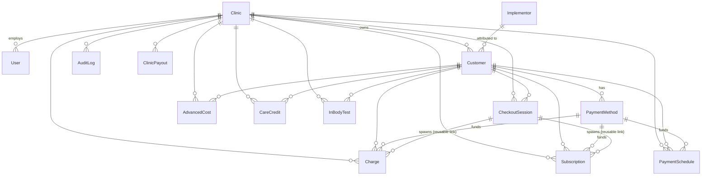

# Data Model

Source of truth: [`prisma/schema.prisma`](../prisma/schema.prisma). Database is
PostgreSQL. **All monetary fields are integer cents** (`amountCents`,
`*Cents`). Ids are `cuid()` strings unless noted.

## Entity-relationship diagram

## Models

### Identity & tenancy

| Model | Purpose | Notable fields |
| --- | --- | --- |
| `User` | Login accounts. | `role` (`SUPER_ADMIN`\|`CLINIC_ADMIN`), `passwordHash`, `clinicId?`, `isActive`. `email` unique. |
| `Clinic` | A tenant. | `slug` unique; contact fields; `isActive`; **revenue-share config** `revosDownPaymentSharePct` (def 50), `implementorFeeCents` (def 14000), `revosRecurringShareCents` (def 7500). |
| `Implementor` | Sales rep for attribution. | `name`, `commissionCents` (def 14000), `isActive`. |
| `Customer` | A patient; belongs to one clinic (nullable to survive clinic delete). | `lunarpayCustomerId?` (unique, cached), name/contact, `isActive` (soft-inactive), `implementorId?`, `paymentNotes?`. Indexed on clinicId, email, phone, implementorId. |

`Role` is a Prisma enum: only `SUPER_ADMIN` and `CLINIC_ADMIN` exist today
(`PROVIDER` / `BILLING_DEPT` are roadmap — see `FUTURE_SCOPE.md`).

### Payments (mirrors of LunarPay state)

| Model | Purpose | Notable fields |
| --- | --- | --- |
| `PaymentMethod` | Cached vaulted card/ACH (no raw card data). | `lunarpayPaymentMethodId` unique; `lunarpayCustomerId?` (real vault owner, preserved across reassignment); `sourceType` (`cc`\|`ach`), `lastDigits`, `expMonth/Year`, `isDefault`, `isActive`. |
| `Charge` | One debit (or auth hold). | `lunarpayChargeId` unique; `fortisTransactionId?`; `amountCents`, `refundedCents`; `status` (`paid`\|`pending`\|`refunded`\|`failed`\|`authorized`\|`voided`); `paymentMethodType`; `description`; `paymentLinkId?`. |
| `Subscription` | Recurring plan. | `lunarpaySubscriptionId` unique; `frequency` (`weekly`\|`monthly`\|`quarterly`\|`yearly`); `status` (`active`\|`cancelled`); `startOn?`, `nextPaymentOn?`; `paymentLinkId?`. |
| `PaymentSchedule` | Installment plan (fixed dated payments). | `lunarpayScheduleId` unique; `status` (`active`\|`completed`\|`cancelled`); `totalAmountCents`, `paidAmountCents`; `paymentsJson` (LunarPay item snapshot). |
| `CheckoutSession` | Hosted checkout **or reusable payment link**. | `token` + `lunarpaySessionId` + `url` unique-ish; `mode` (`payment`\|`subscription`\|`combined`\|`save_card`\|`master`); `status` (`open`\|`completed`\|`expired`); `isGlobal`; `metadataJson`. Reusable link rows stay `open` and spawn many charges/subscriptions. |

> **`status` string enums are stored as plain strings**, not Prisma enums.
> The comments in `schema.prisma` list the accepted values; keep those and the
> code in sync. `Charge.status` also carries `authorized`/`voided` for holds
> (see [`payments.md`](./payments.md)) beyond the values in the schema comment.

### Reporting / revenue share

| Model | Purpose |
| --- | --- |
| `CareCredit` | Money a patient paid the clinic directly via external financing (e.g. CareCredit). RevOS never touches the cash and no card is charged — a manual log. `source` = `manual`\|`master_link`. Split like a down payment; RevOS's share is *owed to RevOS* (subtracted from the clinic balance). |
| `AdvancedCost` | Costs RevOS fronted for a clinic (supplements, booklets, other). `customerId` null = clinic-wide. Reduces RevOS net profit. |
| `ClinicPayout` | Money RevOS has remitted to a clinic. Reduces the clinic balance. |
| `SavedReport` | Saved report filter config (`filtersJson`) + optional `snapshotJson`. |

Full math in [`reporting.md`](./reporting.md).

### Audit & integrations

| Model | Purpose |
| --- | --- |
| `AuditLog` | Sensitive-action trail: `actorId/Role`, `clinicId?`, `action` (e.g. `clinic.create`, `impersonate.start`, `charge.create`), `targetType/Id`, `metadata` (JSON string). Written by `logAudit()`; never throws. |
| `InBodyTest` | One body-composition scan from LookinBody. `dedupeKey` unique; identifiers (`account`, `equipSerial`, `phone`, `phoneNormalized`, `testedAt`); 7 core + 10 segmental metric floats; `resultStatus` (`pending`\|`fetched`\|`matched_no_data`\|`unmatched`\|`error`); `matchStatus` (`unmatched`\|`auto`\|`manual`\|`ambiguous`); `rawJson`/`webhookJson`. Auto-pairs to a `Customer` by normalized phone. |

Details in [`inbody.md`](./inbody.md).

## Delete semantics

- `Customer`, `Clinic`, and other parents use `onDelete: SetNull` for most
  optional relations so history (charges, care credits, InBody tests) survives a
  clinic/customer being removed.
- `PaymentMethod`, `Charge`, `Subscription`, `PaymentSchedule`, `CareCredit`
  cascade-delete with their owning `Customer` (`onDelete: Cascade`).

## Money conventions (repeat, because it matters)

- Store and compute in **cents** (`Int`). Format for humans with
  `formatMoneyCents` (`src/lib/format.ts`).
- Parse user input with `parseMoneyInputToCents`.
- The **only** dollar-denominated boundary is LunarPay's legacy hosted
  `createCheckoutSession` endpoint.

Next: [`auth-and-tenancy.md`](./auth-and-tenancy.md).
