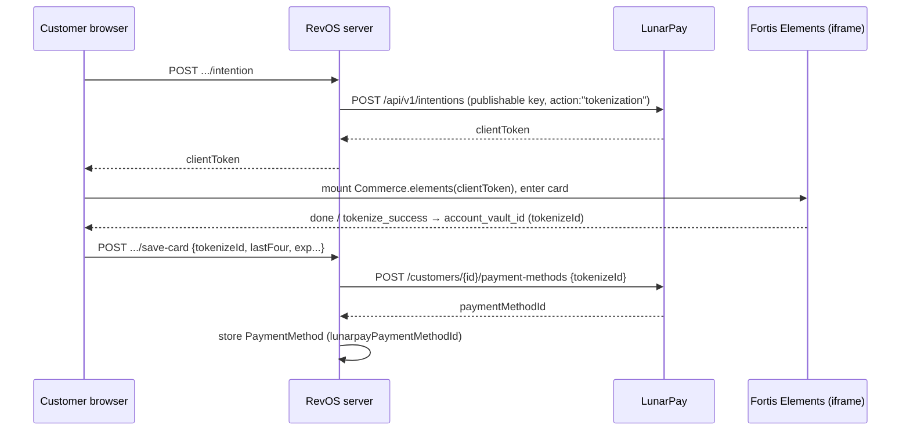
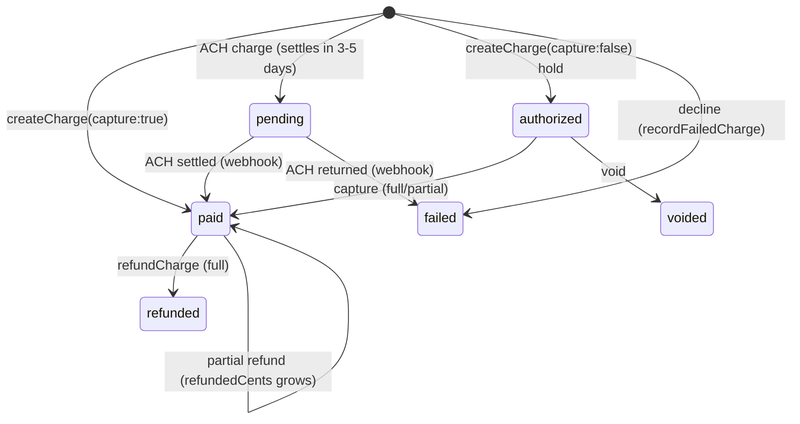

# Payments (LunarPay + Fortis)

All money moves through **one shared LunarPay merchant** (`lp_sk_` / `lp_pk_`).
LunarPay has no clinic concept, so RevOS owns the `Customer → Clinic` mapping and
tags every charge description with `[Clinic Name]` for dashboard auditability.
**Card PANs never touch RevOS** — Fortis Elements tokenizes them client-side.

Core files: `src/lib/lunarpay.ts`, `src/lib/master-link.ts`,
`src/lib/subscription-reconcile.ts`, `src/lib/failed-charge.ts`,
`src/lib/notify.ts`, `src/lib/fees.ts`, and the payment routes under
`src/app/api/clinic/**` and `src/app/api/public/**`.

## Card tokenization flow (Fortis Elements)

Raw card data goes **browser → Fortis**, never to RevOS servers.

- A **`tokenization`** intention vaults the card with **no charge** (preferred).
- The legacy **`ticketId`** path (from a `hasRecurring:true` intention) triggers a
  customer-visible $0.01 auth + refund; still accepted for back-compat but not
  used by the current front-end.
- Both `cc` and `ach` payment methods are requested on the intention to dodge a
  LunarPay bug; the ACH tab is hidden in the UI.

## LunarPay client API surface (`src/lib/lunarpay.ts`)

Base URL `https://app.lunarpay.com`; `Bearer ${SECRET_KEY}`. All amounts are
**integer cents** except `createCheckoutSession` (**dollars**). Failures throw
`LunarPayError`.

| Method | HTTP → endpoint | Purpose |
| --- | --- | --- |
| `createCustomer` | POST `/api/v1/customers` | Create / upsert-by-email a customer. |
| `updateCustomer` | PUT `/api/v1/customers/{id}` | Update name/email/phone. |
| `getCustomer` | GET `/api/v1/customers/{id}` | Fetch a customer. |
| `savePaymentMethod` | POST `/api/v1/customers/{id}/payment-methods` | Vault a card/ACH from `tokenizeId` (preferred) or `ticketId`. |
| `listPaymentMethods` | GET `/api/v1/customers/{id}/payment-methods` | List saved methods. |
| `deletePaymentMethod` | DELETE `/api/v1/customers/{id}/payment-methods/{pmId}` | Remove a method. |
| `createCharge` | POST `/api/v1/charges` | Charge a saved method. `capture:false` → auth hold. |
| `captureCharge` | POST `/api/v1/charges/{id}/capture` | Capture a hold (optional partial amount). |
| `voidCharge` | POST `/api/v1/charges/{id}/void` | Release a hold without charging. |
| `refundCharge` | POST `/api/v1/charges/{id}/refund` | Full/partial refund. |
| `createSubscription` | POST `/api/v1/subscriptions` | Recurring plan (freq, optional `startOn`, `trial`). |
| `updateSubscription` | PATCH `/api/v1/subscriptions/{id}` | Change amount/frequency/`nextPaymentOn`. |
| `getSubscription` | GET `/api/v1/subscriptions/{id}` | Authoritative counters (`successTrxns`, `lastPaymentOn`, …) for reconciliation. |
| `cancelSubscription` | DELETE `/api/v1/subscriptions/{id}` | Cancel. |
| `createSchedule` | POST `/api/v1/payment-schedules` | Installment plan from `payments[{amount,date}]`. |
| `getSchedule` | GET `/api/v1/payment-schedules/{id}` | Fetch schedule + items. |
| `cancelSchedule` | DELETE `/api/v1/payment-schedules/{id}` | Cancel. |
| `createCheckoutSession` | POST `/api/v1/checkout/sessions` | Legacy hosted checkout (**dollars**). |
| `getCheckoutSession` | GET `/api/v1/checkout/sessions/{id}` | Fetch a hosted session. |

The tokenization intention endpoint (`POST /api/v1/intentions`) is called
directly with the **publishable** key from the intention routes — not via this
client.

## Payment concepts

| Concept | What it is | Files |
| --- | --- | --- |
| **Charge** | Immediate debit of a saved method. Manual charges enforce ≥ $0.50 and add the 3.9% + $0.39 fee. Declines recorded via `recordFailedCharge`. | `api/clinic/customers/[id]/charges/route.ts` |
| **Refund** | Full/partial reversal of a *settled* charge; caps at remaining refundable balance; tracks `refundedCents`. Cannot refund a hold. Super-admin gated. | `api/clinic/charges/[id]/refund/route.ts` |
| **Subscription** | Recurring billing; LunarPay's cron drives cycles. On-saved-card mode charges cycle 1 now (unless trial/future start); no-card mode issues a hosted link. | `api/clinic/customers/[id]/subscriptions/route.ts`, `subscriptions/[id]/*` |
| **Payment schedule (installments)** | Fixed set of dated payments; mirrored as `PaymentSchedule` (`paidAmountCents`/`totalAmountCents`), marked `completed` when fully paid. | `api/clinic/schedules/[id]/*` |
| **Hold (auth/capture/void)** | `createCharge({capture:false})` reserves funds (`status:authorized`, CC only, ~7-day window). Capture → `paid` (optional partial); void → `voided`. | `api/clinic/customers/[id]/holds/**` |
| **Checkout session / payment link** | Hosted checkout via `createCheckoutSession` (completion via `checkout.session.completed`), or reusable in-page Fortis links that never flip to `completed`. | `api/public/payment-link/[token]/route.ts` |
| **Save-card link** | Vault a card with no charge via a `save_card` session; saved as new default. | `api/public/save-card/[token]/route.ts`, `api/clinic/customers/[id]/save-card-link/route.ts` |
| **Master link** | One reusable global link where the *payer* chooses amounts: a down payment (optionally split 50/50, second dated payment) + optional fixed **$250/mo** subscription starting on a chosen date (default +30 days). Care-credit amounts are logged, never charged. | `src/lib/master-link.ts`, `master` branch of `api/public/payment-link/[token]/route.ts` |

### Charge / hold state machine

## Fees (`src/lib/fees.ts`)

`calcFee(base) = round(base × 3.9%) + 39¢`; total = base + fee. Applied on top of
the clinic's base price so the **customer** bears it — on one-time charges,
setup fees, each subscription cycle, each installment, and master-link payments.
This customer-facing fee is **RevOS revenue** (see [`reporting.md`](./reporting.md)).

## Webhooks (`src/app/api/webhooks/lunarpay/route.ts`)

- **Verify**: if `LUNARPAY_WEBHOOK_SECRET` set, compare `X-LunarPay-Signature`
  to `sha256=` HMAC of `${timestamp}.${rawBody}` (constant-time). Mismatch → 401.
- **Events**: `payment.succeeded`/`charge.succeeded`, `payment.failed`/`charge.failed`,
  `subscription.cancelled`, `checkout.session.completed` (legacy).
- **Idempotency**: success handlers key `Charge` on `lunarpayChargeId = transaction_id`
  and skip duplicates; failures dedupe on `failed:<externalId>`; legacy session
  completion is idempotent on `status === "completed"`.
- **Success side effects**: create mirror `Charge` (ACH → `pending`, else `paid`),
  delete any reconciliation placeholder for that cycle, advance
  `Subscription.nextPaymentOn`, update `PaymentSchedule` progress, write audit.
- **Failure side effects**: `recordFailedCharge`, auto-cancel sub if
  `data.auto_cancelled`, audit, fire `notifyFailedPayment`.
- **Always returns 200** — even on internal error — so LunarPay stops retrying.

## Reconciliation (`src/lib/subscription-reconcile.ts`)

Webhook deliveries can be lost, so recurring charges may be missing. The
reconciler self-heals by trusting LunarPay's authoritative `getSubscription`
counters:

- Makes recorded renewal charges equal `successTrxns`, creating only the delta,
  dated back one cycle at a time from `lastPaymentOn`.
- **Ignores `nextPaymentOn`** for counting (it advances on failed attempts too).
- Idempotent: each backfilled charge id is `recon:sub:<subId>:<YYYY-MM-DD>`,
  bounded by `successTrxns - alreadyRecorded` (capped `maxPerSub`, default 24),
  and skips cycles a real charge already covers.
- Renewal rows use description `"Subscription renewal"` (the reporting marker).
- Never throws; collects per-subscription errors.
- Runs nightly via `GET /api/cron/reconcile-subscriptions` (`vercel.json`,
  `0 8 * * *`), gated by `Bearer CRON_SECRET`. `dryRun` defaults to `true`;
  the cron passes `false`.

## Failed charges & notifications

- `recordFailedCharge()` (`failed-charge.ts`) persists declines as
  `status:"failed"`. Revenue aggregates only count `paid`/`pending`/`refunded`,
  so failures never inflate revenue. Never throws.
- `notifyFailedPayment()` (`notify.ts`) POSTs a `payment.failed` payload to
  `FAILED_PAYMENT_WEBHOOK_URL` (e.g. Zapier), fire-and-forget with a 5s timeout;
  skipped if the env var is unset.
