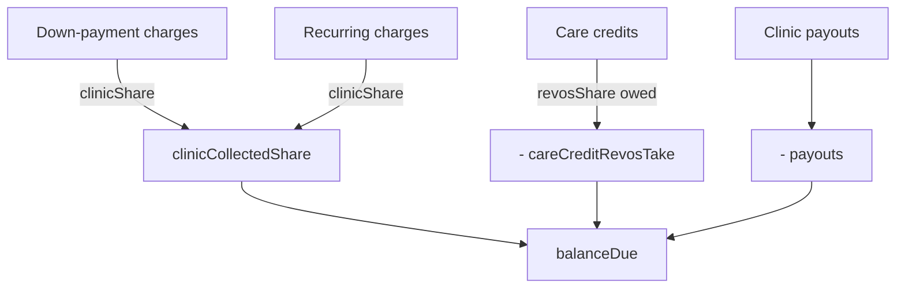

# Reporting & Revenue Share

RevOS earns money two ways on top of raw payments, and splits each payment with
the clinic. The reporting center computes, per period, how much RevOS keeps and
the **running balance RevOS owes each clinic**.

Core files: `src/lib/reporting.ts`, `src/lib/fees.ts`, `src/lib/implementor.ts`,
`src/app/admin/reports/*`. All money is integer cents.

## The two fees

1. **Customer-facing fee** — the 3.9% + $0.39 added on top of the clinic's base
   price and baked into every stored charge amount. **This is RevOS revenue.**
   Recovered from a gross amount by `reverseFee()`.
2. **LunarPay fee** — LunarPay charges RevOS a *second* 3.9% + $0.39 on the gross.
   **This is a RevOS cost**: `lunarpayCostCents(gross) = round(gross×0.039) + 39`.

`reverseFee(total)` inverts `calcFee`: estimates `base = round((total−39)/1.039)`
then probes ±2¢ so `reverseFee(calcFee(x).total) === x` exactly, returning
`{ baseCents, feeCents }`.

## Per-clinic config (`Clinic` model)

| Field | Default | Meaning |
| --- | --- | --- |
| `revosDownPaymentSharePct` | `50` | RevOS's % of the **post-fee base** for down payments *and* care credits (clamped 0–100). |
| `revosRecurringShareCents` | `7500` ($75) | Flat amount RevOS takes per recurring cycle; clinic keeps the rest. |
| `implementorFeeCents` | `14000` ($140) | Default implementor commission per down payment. **Note:** the reporting page uses the linked `Implementor.commissionCents`, not this field. |

## Transaction economics (`reporting.ts`)

For a **down payment** of gross `g` (`downPaymentEconomics`):
```
{ base, fee } = reverseFee(g)
lunarpayCost  = lunarpayCostCents(g)
pct           = clamp(revosDownPaymentSharePct, 0, 100)
revosShare    = round(base × pct / 100)
clinicShare   = base − revosShare
```
Headline split stays clean: `revosProfit = revosShare`, `clinicProfit = clinicShare`.
Commission, fee residual, and advanced costs affect only the aggregate RevOS NET.

For a **recurring** charge of gross `g` (`recurringEconomics`):
```
{ base, fee } = reverseFee(g)
revosShare    = min(base, revosRecurringShareCents)
clinicShare   = base − revosShare
```

For a **care credit** of raw `a` (`careCreditEconomics`) — no card, so **no fee**:
```
revosShare  = round(a × revosDownPaymentSharePct / 100)
clinicShare = a − revosShare
```
Because the clinic already holds this cash, RevOS's share is money the clinic
**owes RevOS**.

## Charge classification

A charge counts as **recurring** iff its `description` matches
`/subscription renewal/i` — the exact marker written by the LunarPay webhook and
the reconciler. Everything else is a **down payment**. (Keep this string in sync
across `webhooks/lunarpay`, `subscription-reconcile.ts`, and `reports/page.tsx`.)

## The clinic-balance formula (key deliverable)

Per clinic, within the selected period, the reporting page accumulates:

```
balanceDue =
    Σ clinicShare(down-payment charges)     // base − round(base × pct/100)
  + Σ clinicShare(recurring charges)         // base − min(base, revosRecurringShareCents)
  − Σ revosShare(care credits)               // round(amount × pct/100)  (clinic owes this)
  − Σ ClinicPayout.amountCents               // already remitted
```

Implementor commissions, processing-fee residual, and advanced costs do **not**
enter the clinic balance — they only affect RevOS NET.



## Aggregate RevOS NET (for contrast)

```
revosShareTotal = revosDownShare + revosRecurringShare + careCreditRevosShare
feeResidual     = processingFeeRevenue + recurringProcessingFee
                  − lunarpayCost − recurringLunarpayCost
revosNet        = revosShareTotal + feeResidual − implementorCommission − advancedCosts
```

Failed charges (`status:"failed"`) are surfaced as a **risk metric only** and are
never counted as revenue.

## Period presets (`resolvePeriod`)

`mtd`, `last_month`, `ytd`, `range` (custom, day-bounded), `all` (unbounded).

## Reporting UI (`src/app/admin/reports/*`)

| File | Role |
| --- | --- |
| `page.tsx` | Server component: pulls charges (`paid`/`refunded`), advanced costs, care credits, payouts for the period; computes all economics + clinic balances; renders cards, breakdowns, per-patient table, clinic-balance table; builds CSV. |
| `report-actions.tsx` | Save/load/delete saved reports; download CSV (Blob); download PDF (`window.print`). |
| `reports-filters.tsx` | Preset / date / clinic / implementor filters. |
| `advanced-cost-form.tsx` + `delete-cost-button.tsx` | Create / delete advanced costs. |
| `clinic-payout-form.tsx` + `delete-payout-button.tsx` | Create / delete payouts. |

## Implementor attribution (`src/lib/implementor.ts`)

`resolveOrCreateImplementorByName(name)`: trims, rejects empty / >120 chars,
case-insensitively finds an existing implementor or creates a new one. Lets the
`?implementor=<name>` payment-link tag attribute a customer before the
implementor is set up in admin. Each attributed down payment pays that
implementor `commissionCents` (a RevOS-NET cost).
